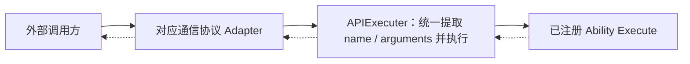

# project_template_go

Go 服务项目模版：统一 API 编排（JSON-RPC / MCP / WebSocket / gRPC 四协议同一调用链）+ Ability 装配 + MySQL/GORM + 开发测试台 + 文档生成，一条命令实例化为新项目。

## Quick Start

**已有 `go.mod`**（module path 自动读取，无需传参）：

```bash
cd my_project
wget -qO- https://raw.githubusercontent.com/0xYeah/project_template_go/main/new_project.sh | bash
```

**没有 `go.mod`**（手动传 module path）：

```bash
cd my_project
wget -qO- https://raw.githubusercontent.com/0xYeah/project_template_go/main/new_project.sh | bash -s -- my_project
wget -qO- https://raw.githubusercontent.com/0xYeah/project_template_go/main/new_project.sh | bash -s -- github.com/myorg/my_service
```

`new_project.sh` 会：重写全部 module path 与项目名引用；patch `config/config.go` 常量（`ProjectName` / `ProjectVersion`→`v0.0.1` / `ProjectBundleID`）；重命名 `example_files/` 带模版名的文件；清空 `changelog/`；保留已有 `LICENSE` 与 `README.md`；最后删除自身。仅依赖 `git` 与 `bash`。

## API 通信与执行架构

项目统一复用 MCP Tool Call 数据模型。MCP、JSON-RPC、WebSocket 和 gRPC 都运输同一份 `tools/call → name → arguments` 请求，并返回同一份 MCP `CallToolResult`；只有通信协议外壳不同。完整规范见 [`docs/api_description.md`](docs/api_description.md)。



### 模块职责

```text
project_template_go
├── api
│   ├── api_services.go        按配置启动和停止各通信协议服务
│   ├── api_jsonRPC            JSON-RPC 接入与响应
│   ├── api_mcp                MCP 接入（官方 Go SDK，协议 2026-07-28）
│   ├── api_websocket          WebSocket 接入并写回原 connection
│   ├── api_grpc               单一 APIService.Call RPC（proto 源 + 生成物分目录）
│   ├── api_executer           唯一业务执行入口，统一提取、编解码与准入门禁（非 Public 方法验 jwt_token）
│   ├── api_supported_methods  方法描述、Execute、Public 标志与有序目录（文档唯一事实源）
│   ├── api_auth               API 权限准入域：验证码、注册、登录、session/JWT、统一门禁（契约见 docs/ability_auth.md）
│   └── api_error_code         通用业务错误码
├── ability                    父包带子包装配；默认注册 test 方法；ability_user 持 User model 与密码校验
├── db                         GlobalMysqlCtl 唯一 MySQL 入口 + AutoMigrate 登记
├── config                     ProjectName/Version/BundleID + YAML/JSON/TOML 配置装配
├── common                     信号处理、panic 兜底
├── custom_cmd                 主程序子命令（version 等）
├── test_ui                    开发测试台（13003）：四协议调试 + /docs_api 文档页
└── docs                       api_description.md（内部契约）+ api_methods.md（生成）
```

### 关键约束（全文见 `AGENTS.md`）

- `APIExecuter` 是唯一执行入口，不维护业务 `switch`；新增业务方法只在 Ability 子包注册并由直属父包加载。
- 统一准入门禁：非 `Public` 方法 Execute 前经 `api_auth_session` 验证 `arguments.jwt_token`，身份经 context 下传；`ability` 树内零鉴权代码（Auth/User 契约见 [`docs/ability_auth.md`](docs/ability_auth.md) / [`docs/ability_user.md`](docs/ability_user.md)）。
- 业务失败统一 `CallToolResult`（HTTP 200 + `isError=true`）；协议错误只留给外壳损坏与服务故障。
- `docs/api_methods.md` 由 `./gen_api_docs.sh` 从方法注册表生成；对外文档仅 `GET /docs_api` 单页（服务端注入）。
- proto 只由 `./gen_proto.sh` 生成；发版走 `./git_tag.sh`（自动刷新方法文档与 changelog）。

### 默认端口

JSON-RPC `13001`、MCP `13002`、test_ui `13003`、WebSocket `13004`、gRPC `13005`。
