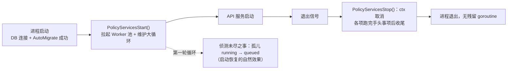

[← 返回 README](../README.md)

# Policy 维护调度契约

## 预期目的

`policy` 是进程生命周期维护调度层：统一承载**重启后的未尽之事**（启动恢复）、**长驻循环**与**定期轮询**三类维护事项的拉起、停止与日志包裹。它解决的是「重启维护后很多事情都需要续起来」的通用问题——异步任务恢复只是首个租户，不与任何业务域耦合。

## 形态（拍板定案：单入口，对齐 api_services）

对外只有两个方法——`PolicyServicesStart()` / `PolicyServicesStop()`（对齐 `api.StartAPIServices` / `StopApiServices` 形态），`main.go` 各一行调用。具体维护事项**封装在 policy 包内部**：policy 是维护调度域，它直接 import 各域的维护函数（同 api_services import ability 先例），层次为 main（启动编排）→ policy（维护域编排）→ 各域函数（具体逻辑）。

`PolicyServicesStart` 内部两件事：

1. **长驻执行域**（goroutine）：`ability_task.RunAsyncTaskWorkers`——Worker 池并发数由 `task_cfg.worker_count` 决定，节奏域内自管。
2. **周期维护大循环**（单 goroutine）：每轮把内部方法清单各**单次执行**一遍 → 执行完间隔 `policy_cfg.policy_duration`（每轮现读现解，执行耗时不计入间隔、天然防重叠）→ 下一轮。当前清单：
   - `ability_task.RequeueOrphanedTasks`——**侦测未尽之事**：DB `running` 且不在本进程 in-flight 执行集合的孤儿任务 → 重置 `queued` 拉起来继续。
   - `api_auth_verify_code.PurgeExpired`——清理过期超 24h 的验证码行。

**无特权启动阶段**：进程重启后第一轮循环时 in-flight 为空，死进程遗留的 running 自动全部捞回——启动恢复即第一轮循环的自然效果；运行中意外产生的孤儿同样每轮自愈。

## 生命周期

## 纪律

- 新增维护事项 = 对应域写一个普通导出函数 + policy 大循环清单加一行调用；`main.go` 永不再动。
- 各域维护函数自含业务语义（恢复条件、清理窗口），policy 只管调度节奏、停止与统一日志（`policy maintenance [名称]` 前缀，运维按名 grep）。
- 间隔配置 `policy_cfg.policy_duration`：Go duration 字符串（`"10s"`/`"1h"`），每轮循环**用时现解**；缺省或非法回落 10s 并输出字段级警告。

## 当前实现

- [ ] 🟡 DONE — `PolicyServicesStart` / `PolicyServicesStop` 单入口接入 `main.go`（各一行）。
- [ ] 🟡 DONE — 首批维护清单：孤儿任务侦测拉起（in-flight 防误拉）、Worker 池长驻、验证码过期清理。
- [ ] ⬜ TODO — done 任务归档/清理进大循环清单（保留窗口待拍板）。